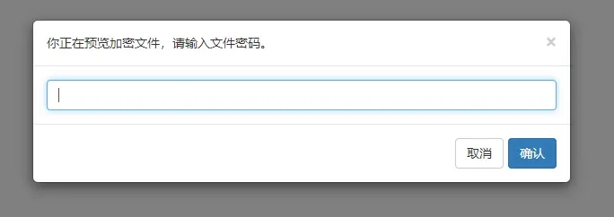
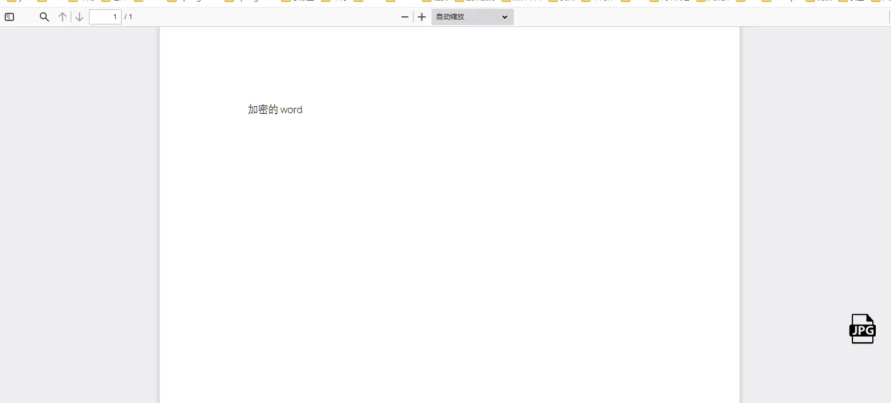
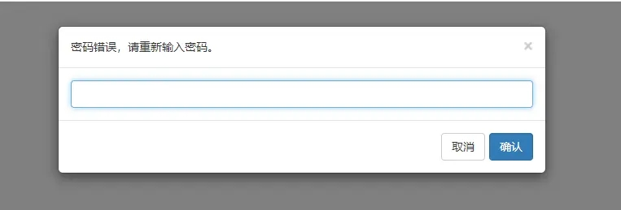

当您的项目内需要预览文件时，只需要调用浏览器打开本项目的预览接口，并传入须要预览文件的url。

注意，如果要预览的url里包含需要转义的特殊字符，如下表格，请使用encodeURIComponent(url)转义

| 符号 | url中转义结果                | 转义码 |
| :--- | :--------------------------- | :----- |
| +    | URL 中+号表示空格            | %2B    |
| 空格 | URL中的空格可以用+号或者编码 | %20    |
| /    | 分隔目录和子目录             | %2F    |
| ？   | 分隔实际的URL和参数          | %3F    |
| %    | 指定特殊字符                 | %25    |
| #    | 表示书签                     | %23    |
| &    | URL 中指定的参数间的分隔符   | %26    |
| =    | URL 中指定参数的值           | %3D    |

## 1. 普通文件下载url预览

### 3.x.x 版本  

```javascript
<script type="text/javascript" src="https://cdn.jsdelivr.net/npm/js-base64@3.6.0/base64.min.js"></script>

var url = 'http://127.0.0.1:8080/file/test.txt'; //要预览文件的访问地址
window.open('http://127.0.0.1:8012/onlinePreview?url='+encodeURIComponent(Base64.encode(url)));
```

### 2.x.x 及以下版本  

```javascript
var url = 'http://127.0.0.1:8080/file/test.txt'; //要预览文件的访问地址
window.open('http://127.0.0.1:8012/onlinePreview?url='+encodeURIComponent(url));
```

## 2. http/https下载流url预览

很多系统内不是直接暴露文件下载地址，而是请求通过id、code等参数到通过统一的接口，后端通过id或code等参数定位文件，再通过OutputStream输出下载，此时下载url是不带文件后缀名的，预览时需要拿到文件名，传一个参数`fullfilename=xxx.xxx`来指定文件名，示例如下

### 3.x.x 版本  

```javascript
<script type="text/javascript" src="https://cdn.jsdelivr.net/npm/js-base64@3.6.0/base64.min.js"></script>

var originUrl = 'http://127.0.0.1:8080/filedownload?fileId=1'; //要预览文件的访问地址
var previewUrl = originUrl + '&fullfilename=test.txt'
window.open('http://127.0.0.1:8012/onlinePreview?url='+encodeURIComponent(Base64.encode(previewUrl)));
```

### 2.x.x 及以下版本  

```javascript
var originUrl = 'http://127.0.0.1:8080/filedownload?fileId=1'; //要预览文件的访问地址
var previewUrl = originUrl + '&fullfilename=test.txt'
window.open('http://127.0.0.1:8012/onlinePreview?url='+encodeURIComponent(previewUrl));
```

## 3. FTP下载url预览

### 1). FTP匿名访问

如果要预览的FTP url是可以匿名访问的（不需要用户名密码），则可以直接通过下载url预览，示例如下

#### 3.x.x 版本  

```javascript
<script type="text/javascript" src="https://cdn.jsdelivr.net/npm/js-base64@3.6.0/base64.min.js"></script>

var url = 'ftp://127.0.0.1/file/test.txt'; //要预览文件的访问地址
window.open('http://127.0.0.1:8012/onlinePreview?url='+encodeURIComponent(Base64.encode(url)));
```

#### 2.x.x 及以下版本  

```javascript
var url = 'ftp://127.0.0.1/file/test.txt'; //要预览文件的访问地址
window.open('http://127.0.0.1:8012/onlinePreview?url='+encodeURIComponent(url));
```

### 2). 非匿名访问，确定只有访问一台FTP服务器

如果预览服务只访问一台FTP服务器，只需要在配置文件中 [配置FTP链接信息](https://kkfileview.keking.cn/zh-cn/docs/config.html)  ，则可以直接通过下载url预览，示例如下

#### 3.x.x 版本  

```javascript
<script type="text/javascript" src="https://cdn.jsdelivr.net/npm/js-base64@3.6.0/base64.min.js"></script>

var url = 'ftp://127.0.0.1/file/test.txt'; //要预览文件的访问地址
window.open('http://127.0.0.1:8012/onlinePreview?url='+encodeURIComponent(Base64.encode(url)));
```

#### 2.x.x 及以下版本  

```javascript
var url = 'ftp://127.0.0.1/file/test.txt'; //要预览文件的访问地址
window.open('http://127.0.0.1:8012/onlinePreview?url='+encodeURIComponent(url));
```

### 3).  非匿名访问，不只访问一台FTP服务器

如果预览服务要访问多台FTP服务器，且用户名密码不一致，可以通过在url中加入用户名密码等参数预览(url参数中的优化于配置文件中的)，示例如下

#### 3.x.x 版本  

```javascript
<script type="text/javascript" src="https://cdn.jsdelivr.net/npm/js-base64@3.6.0/base64.min.js"></script>

var originUrl = 'ftp://127.0.0.1/file/test.txt'; //要预览文件的访问地址
var previewUrl = originUrl + '?ftp.username=xx&ftp.password=xx&ftp.control.encoding=xx';
window.open('http://127.0.0.1:8012/onlinePreview?url='+encodeURIComponent(Base64.encode(previewUrl)));
```

#### 2.x.x 及以下版本  

```javascript
var originUrl = 'ftp://127.0.0.1/file/test.txt'; //要预览文件的访问地址
var previewUrl = originUrl + '?ftp.username=xx&ftp.password=xx&ftp.control.encoding=xx';
window.open('http://127.0.0.1:8012/onlinePreview?url='+encodeURIComponent(previewUrl));
```

## 4. 加密office预览
预览加密office效果如下：



输入密码后正常预览office文件：



密码输入错误提示：



### 加密office预览缓存
由于加密office存在文档保密性，应该区分用户进行缓存，而不是全平台预览一次后，后续用户不需要输入密码即可查看，因此加密office若为收到 `userToken` 参数将不缓存。

缓存加密office `userToken` 请求示例：

```url
http://192.168.40.19:8012/onlinePreview?url=aHR0cDovLzE5Mi4xNjguNDAuMTk6ODAxMi9kZW1vL%2BWKoOWvhndvcmQuZG9jeA%3D%3D&userToken=9527&filePassword=123456
```
- `userToken`：需前端在发起预览文件时主动带上此参数（基于`userToken`进行转码结果缓存）
- `filePassword`：当用户输入密码后此参数会自动带上（可忽略）

更多使用方面的问题，详见[常见问题](https://kkfileview.keking.cn/zh-cn/docs/faq.html)
